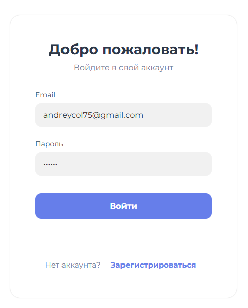
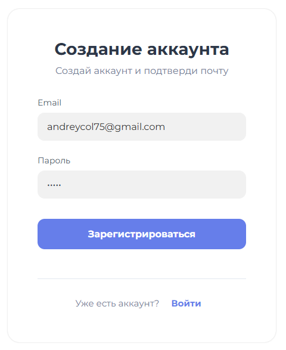
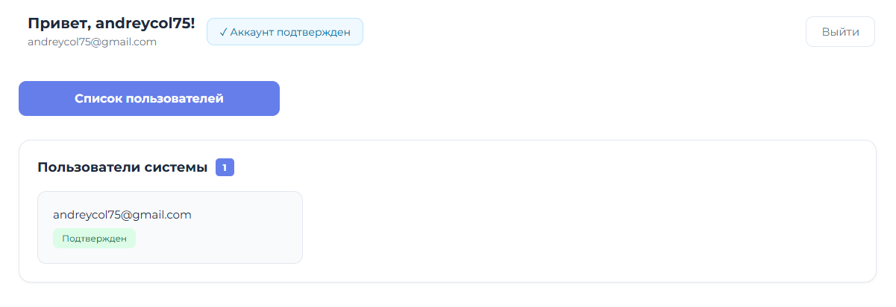
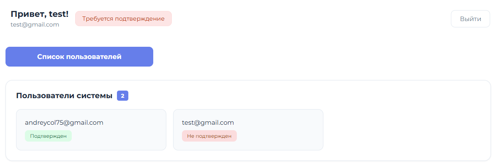
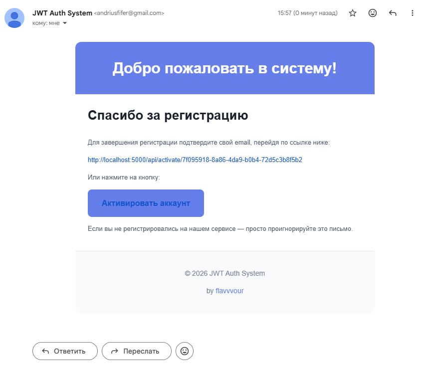

# JWT Authentication System | Fullstack React + Node.js

[](https://developer.mozilla.org/en-US/docs/Web/JavaScript)
[](https://www.typescriptlang.org/)
[](https://nodejs.org/)
[](https://expressjs.com/)
[](https://www.mongodb.com/)
[](https://reactjs.org/)
[](https://mobx.js.org/)

<!-- [](https://jwt.io/)
[](https://developer.mozilla.org/en-US/docs/Web/HTTP/CORS)
[](https://github.com/kelektiv/node.bcrypt.js)
[](https://nodemailer.com/)
[](https://www.postman.com/)
[](https://prettier.io/)
[](https://git-scm.com/)
[](https://code.visualstudio.com/)
[](LICENSE) -->

## Содержание

- [О проекте](#-о-проекте)
- [Ключевые возможности](#-ключевые-возможности)
- [Интерфейс и примеры работы](#-интерфейс-и-примеры-работы)
- [Технологии и инструменты](#-технологии-и-инструменты)
- [API Endpoints](#-api-endpoints)
- [Примеры запросов](#-примеры-запросов)
- [Безопасность](#-безопасность)
- [Установка и запуск](#-установка-и-запуск)
  - [Клонирование](#-1-клонирование)
  - [Установка зависимостей](#-2-установка-зависимостей)
  - [Переменные окружения](#-3-переменные-окружения)
  - [Настройка базы данных](#-4-настройка-базы-данных)
  - [Запуск проекта](#-5-запуск-проекта)
  - [Как проверить работу](#-6-как-проверить-работу)
- [Тестирование](#-тестирование)
- [Поддержка пакетного менеджера](#-поддержка-пакетного-менеджера)
- [Лицензия](#-лицензия)

## О проекте

Полноценная fullstack-система аутентификации, построенная по современным принципам безопасности и чистой архитектуры.

**Проект охватывает весь цикл разработки:**

- **Проектирование** API и потоков данных
- **Реализация** бэкенда (Node.js + Express) и фронтенда (React + TypeScript)
- **Безопасное хранение** паролей (bcrypt), токенов (JWT), сессий (httpOnly)
- **Централизованное управление состоянием** через MobX
- **Автоматическая обработка сессий** при истечении токена
- **Интеграция с внешними сервисами** (Nodemailer → SMTP)
- **Тестирование** всех сценариев в Postman

## Ключевые возможности

- Регистрация с подтверждением email
- Вход / Выход
- Двухуровневая аутентификация (access + refresh token)
- Хранение `refreshToken` в `httpOnly`-куке (защита от XSS)
- Автоматическое обновление сессии при истечении токена
- Восстановление сессии после перезагрузки
- Защита маршрутов через middleware
- Реактивное управление состоянием (MobX)
- Адаптивный интерфейс с PWA-поддержкой

## Интерфейс и примеры работы

### Вход в систему



### Регистрация



### Личный кабинет (после входа)

 

### Письмо активации на email



---

## Технологии и инструменты

| Слой               | Технологии                                                            |
| ------------------ | --------------------------------------------------------------------- |
| **Frontend**       | React, TypeScript, MobX, Axios, CSS Modules                           |
| **Backend**        | Node.js, Express, MongoDB, Mongoose, JWT, bcrypt, Nodemailer          |
| **API**            | REST, JSON, CORS, `Authorization` Bearer, `withCredentials`           |
| **Безопасность**   | `httpOnly` cookie, localStorage (access), refresh rotation, CSRF-safe |
| **Инструменты**    | Postman, Prettier                                                     |
| **Форматирование** | Единый стиль через Prettier (`singleQuote`, `semi`, `printWidth: 80`) |

---

## API Endpoints

Все маршруты доступны по префиксу `/api`.  
Токены: `accessToken` (15 мин), `refreshToken` (в `httpOnly`-куке).

| Метод  | Эндпоинт              | Описание                                                                          | Требует авторизации  |
| ------ | --------------------- | --------------------------------------------------------------------------------- | -------------------- |
| `POST` | `/api/registration`   | Регистрация пользователя. Отправляет письмо активации.                            | ❌                   |
| `POST` | `/api/login`          | Аутентификация. Возвращает `accessToken` и устанавливает `refreshToken` в cookie. | ❌                   |
| `POST` | `/api/logout`         | Выход. Удаляет `refreshToken` с сервера и из cookie.                              | ✅                   |
| `GET`  | `/api/activate/:link` | Активация аккаунта по уникальному токену из email.                                | ❌                   |
| `GET`  | `/api/refresh`        | Обновление сессии. Выдаёт новый `accessToken`, если `refreshToken` валиден.       | ❌ (но требует куку) |
| `GET`  | `/api/users`          | Получение списка всех пользователей.                                              | ✅                   |

---

## Примеры запросов

### 1. Регистрация

```http
POST /api/registration
Content-Type: application/json

{
  "email": "user@example.com",
  "password": "password123"
}
```

### 2. Вход

```http
POST /api/login
Content-Type: application/json

{
  "email": "user@example.com",
  "password": "password123"
}
```

Ответ:

```json
{
  "accessToken": "eyJ...",
  "user": {
    "id": "60d2...",
    "email": "user@example.com",
    "isActivated": false
  }
}
```

> refreshToken устанавливается в httpOnly-куку автоматически.

### 3. Доступ к защищённому маршруту

```http
GET /api/users
Authorization: Bearer eyJ...
```

### 4. Обновление сессии

```http
GET /api/refresh
Cookie: refreshToken=abc123def456...
```

> Возвращает новый accessToken. Используется автоматически через Axios Interceptors.

### 5. Выход

```http
POST /api/logout
Cookie: refreshToken=abc123def456
```

> Сервер удаляет refreshToken из БД, кука удаляется через clearCookie.

## Безопасность

1. accessToken (15 мин) — в Authorization заголовке
2. refreshToken (30 дней) — в httpOnly, SameSite=Strict куке
3. Сессия восстанавливается автоматически через /refresh
4. Пароли хешируются через bcrypt
5. Валидация входных данных (express-validator)
6. DTO-слой исключает передачу чувствительных данных

## Установка и запуск

### 1. Клонирование

```
git clone https://github.com/flavvvour/jwt-authorization.git

cd jwt-authorization
```

### 2. Установка зависимостей

**Backend (Node.js)**

Перейдите в папку `server` и установите зависимости:

```bash
cd server
npm install
```

Основные зависимости:

`express` — веб-сервер\
`mongoose` — работа с MongoDB\
`bcrypt `— хеширование паролей\
`jsonwebtoken` — генерация JWT\
`uuid` — генерация ссылок активации\
`nodemailer` — отправка email\
`dotenv` — переменные окружения\
`cors`, `cookie-parser`, `express-validator` — безопасность и валидация

---

**Frontend (React + TypeScript)**

Откройте новый терминал в папке `client`:

```bash
cd client
npm install
```

Ключевые зависимости:

`react`, `react-dom` — основа интерфейса\
`typescript` — типизация\
`mobx-react-lite`, makeAutoObservable — управление состоянием\
`axios` — HTTP-запросы\
`@types/*` — типы для TypeScript

### 3. Переменные окружения

Создайте файл `.env` в папке `server/` и заполните его значениями:

```env
PORT=5000

DB_URI=mongodb://localhost:27017/jwt_auth

API_URL=http://localhost:5000
CLIENT_URL=http://localhost:3000

JWT_ACCESS_SECRET=your_strong_access_secret_here
JWT_REFRESH_SECRET=your_strong_refresh_secret_here

SMTP_HOST=smtp.gmail.com
SMTP_PORT=587
SMTP_USER=your_email@gmail.com
SMTP_PASSWORD=your_app_password_here
```

**Пояснения:**

> `PORT=5000` (порт сервера)\
> `DB_URI`=mongodb://... (взять ссылку c Mongo ATLAS)\

> URL приложения (для email и redirect)\
> `API_URL`=http://localhost:5000 (backend)\
> `CLIENT_URL`=http://localhost:3000 (frontend)

> Секреты для JWT\
> `JWT_ACCESS_SECRET`=your_strong_access_secret\
> `JWT_REFRESH_SECRET`=your_strong_refresh_secret

> Настройки SMTP (пример для Gmail)\
> `SMTP_HOST`=smtp.gmail.com (smtp gmail, можно узнать в настройках аккаунта)\
> `SMTP_PORT`=587 (стандартный порт для smtp)\
> `SMTP_USER`=your_email@gmail.com (email с которого будет рассылка писем)\
> `SMTP_PASSWORD`=your_app_password

- **ВАЖНО**: `SMTP_PASSWORD` — это пароль приложения, а не пароль от аккаунта Gmail.
  Его можно получить в настройках аккаунта Google → "Безопасность" → "Пароли приложений".

### 4. Настройка базы данных

Проект использует **MongoDB Atlas** (облако).  
Зарегистрируйтесь на [cloud.mongodb.com](https://cloud.mongodb.com) и:

1. Создайте кластер (можно бесплатный)
2. В **Database Access** — добавьте пользователя
3. В **Network Access** — разрешите `0.0.0.0/0` (или ваш IP)
4. Скопируйте строку подключения:  
   `mongodb+srv://<username>:<password>@cluster0.xxxxx.mongodb.net/jwt_auth`
5. Вставьте её в `DB_URI` (в `.env`)
   > Если не удаётся подключиться — проверьте интернет или используйте VPN.

```env
DB_URI=mongodb+srv://<username>:<password>@cluster0.xxxxx.mongodb.net/jwt_authorization
```

7. Замените <username> и <password> на данные вашего пользователя

> **Примечание:**\
> Доступ к MongoDB Atlas может быть ограничен в некоторых регионах.
> Если не удаётся подключиться — проверьте доступность сервиса или используйте VPN.

> **Преимущество Atlas:** не нужно устанавливать ничего локально, работает из коробки.

### 5. Запуск проекта

Запустите Backend и Frontend **в двух отдельных терминалах**.

#### 1. Запуск сервера (Backend)

```bash
cd server && npm run dev
```

Сервер запустится на: `http://localhost:5000`\
Проверьте: `http://localhost:5000/api/users` — должен вернуть 401 или список (если авторизованы)

#### 2. Запуск клиента (Frontend)

```bash
cd client && npm start
```

Приложение откроется в браузере: `http://localhost:3000`\
Если не открылось — перейдите вручную.

### 6. Как проверить работу

> Полный сценарий тестирования — от регистрации до доступа к защищённым данным.

#### Через интерфейс (рекомендуется)

1. Перейдите в браузер:  
   [http://localhost:3000](http://localhost:3000)
2. Нажмите **«Зарегистрироваться»**
3. Введите:
   - Email: `test@example.com`
   - Пароль: `password123` (минимум 5 символов)
4. Нажмите **«Зарегистрироваться»**
5. Проверьте **почтовый ящик** — пришло письмо с кнопкой активации
6. Нажмите на ссылку в письме (или скопируйте)
7. Вас перенаправит на страницу входа — аккаунт активирован
8. Войдите, используя те же данные
9. Перейдите в раздел **«Список пользователей»**  
   Должен отобразиться список (только для авторизованных)

---

#### Альтернатива: через Postman (API)

1. Откройте Postman
2. Отправьте `POST /api/registration`:

   ```json
   {
     "email": "test@example.com",
     "password": "password123"
   }
   ```

3. Проверьте почту → перейдите по ссылке активации
4. Вы можете использовать бесплатный сервис для временного адреса email\
   [https://www.mohmal.com/ru/inbox](https://www.mohmal.com/ru/inbox)

5. Выполните `POST /api/login`:
   ```json
   {
     "email": "test@example.com",
     "password": "password123"
   }
   ```
6. Получите accessToken и refreshToken (в куке)
7. Вызовите `GET /api/users` с заголовком:\
   `Authorization: Bearer <ваш accessToken>`\
   → Должен вернуться список пользователей

> Используйте оба способа — убедитесь, что система работает на всех уровнях.

## Тестирование

Все API-эндпоинты были протестированы в **Postman**, включая крайние случаи:

- Регистрация → отправка письма активации → переход по ссылке
- Вход → получение `accessToken` и `refreshToken`
- Доступ к защищённым маршрутам (`/api/users`, `/api/user/me`)
- Автоматическое обновление сессии через `GET /api/refresh`
- Выход → удаление `refreshToken` с сервера и из куки
- Повторный запрос к `/api/refresh` после выхода → `401 Unauthorized`

---

## Поддержка пакетного менеджера

Проект использует **npm** как основной пакетный менеджер.

### Возможности:

- Все зависимости в `package.json` — бэкенд и фронтенд
- Скрипты запуска:
  - `npm run dev` — запуск сервера с автоперезагрузкой
  - `npm start` — запуск фронтенда
  - `npm run format` — единый стиль через Prettier
  - `npm run lint` — проверка кода (ESLint)
- Поддержка:
  - `npx` — запуск инструментов без установки
  - `npm link` — локальная разработка и отладка пакетов

> Работает со всеми npm-совместимыми менеджерами (например, `pnpm`, `yarn` при необходимости).

---

## Лицензия

Распространяется под лицензией [MIT](LICENSE)
